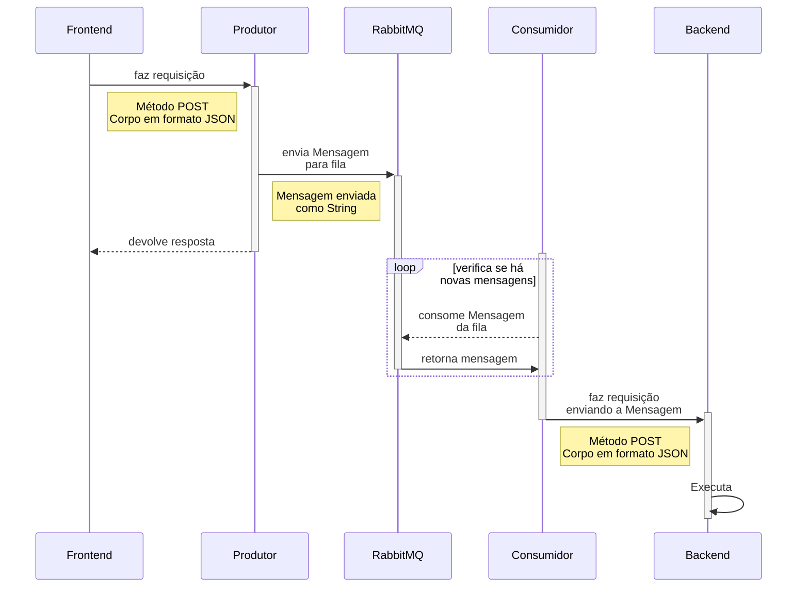

# Entrega-Mais-Filas

> Repositório contendo consumidor e produtor usados para enviar e receber mensagens do RabbitMQ

## Pré-requisitos
---

É necessário a instalação dos seguintes recursos:

- [Docker](https://docs.docker.com/get-docker/) e [WSL 2](https://docs.microsoft.com/en-us/windows/wsl/install)
- [Node](https://nodejs.org/en/download/)

Desative o git's automatic conversion e realise o checkout em outra branch, depois volte para a branch original:
```
git config --global core.autocrlf input

git checkout <outra_branch>

git checkout <branch_original>
```

## Iniciando via Docker
Na raiz do projeto, onde há o arquivo `docker-compose.yml`, execute o seguinte comando:
```
docker compose build
```
Em seguida, suba o container com o seguinte comando:
```
docker compose up
```
<!--
- Será criado volumes gerenciados pelo próprio **Docker** na sua maquina local, a fim de persistir os dados
- **RabbitMQ** será iniciado na porta **`5672`**
	- **Management Console** será iniciado na porta **`15672`**
	- user: **`ifpb`**
	- password: **`ifpb`**
- **Postgres** serão iniciados na porta **`5432`**
	- **pgAdmin** será iniciado na porta **`5050`**
	- user: **`ifpb`**
	- password: **`ifpb`** -->


## Iniciando Localmente
---
Na raiz do projeto execute o seguinte comando instale as dependencias para desenvolvimento:
> Esse comando instala o gerenciador de processos [**pm2**](https://www.npmjs.com/package/pm2) globalmente.

```
npm run install:dev
```
Em seguida, instale todas as dependências:
```
npm install
```
Agora basta executar o seguinte comando para subir o servidor:
```
npm start
```


## Usando Entrega-Mais-Filas-Node
--- 
Agora basta enviar requisições com o método **`POST`** para a porta **`3000`**:
```
http://localhost:7710/
```
Com o corpo da requisição contendo um JSON neste formato:
```
{
	email: <email@email.com>,
	password: <password>
}
```


## Diagrama Sequencial
---

---
[⬆ Voltar ao topo](#Entrega-Mais-Filas)
