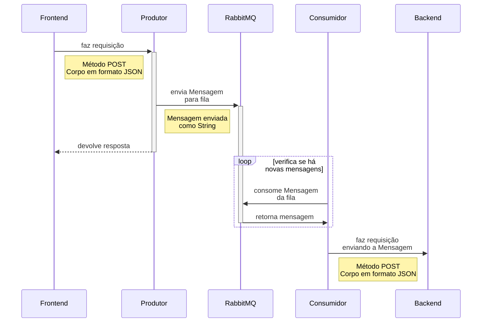

```mermaid
sequenceDiagram
    participant Frontend
	participant Produtor
    participant RabbitMQ
    participant Consumidor
	participant Backend
	#-----------------------------------------------#
	Frontend ->>+ Produtor: faz requisição 
	Note right of Frontend: Método POST <br> Corpo em formato JSON
	Produtor ->>+ RabbitMQ: envia Mensagem <br> para fila
	Note right of Produtor: Mensagem enviada <br> como String
	Produtor -->>- Frontend: devolve resposta
	
    loop verifica se há <br> novas mensagens
	Consumidor ->> RabbitMQ: consome Mensagem <br> da fila
	RabbitMQ ->>- Consumidor: retorna mensagem
    end

	Consumidor ->> Backend: faz requisição <br> enviando a Mensagem
	Note left of Backend: Método POST <br> Corpo em formato JSON

```